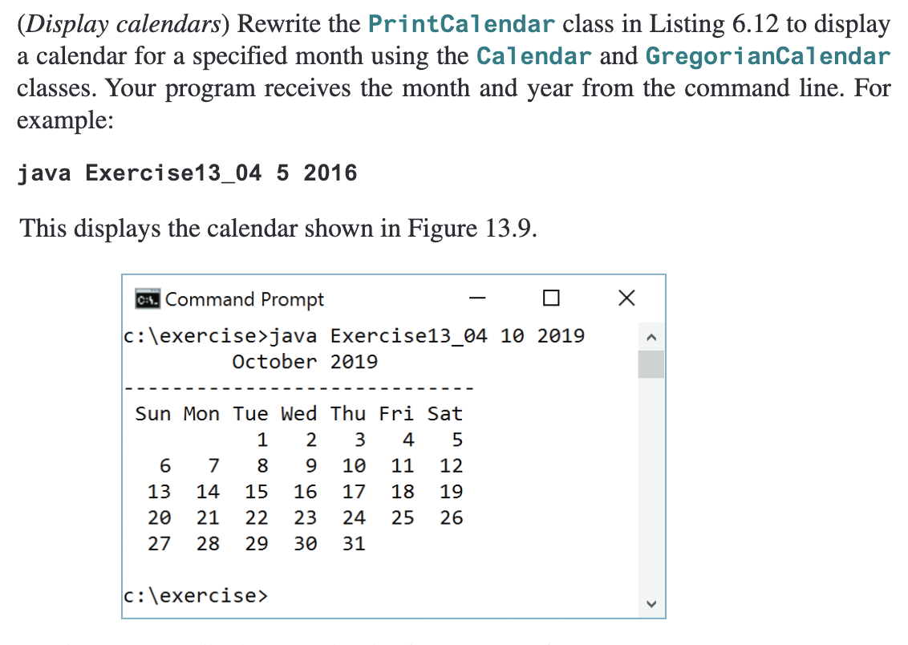

---
**Note**

The `PrintCalendar` class in Listing 6.12 comes from the first calendar program you built in COMPRO1.

It is the modular version that applies **Zeller’s congruence**.

Your task:

* Review the capabilities of the `GregorianCalendar` and `Calendar` classes.
* Identify built-in methods that handle calendar calculations.
* Replace the user-defined methods in the original `PrintCalendar` class with the equivalent built-in methods.

Focus on removing manual date calculations and relying on the Java calendar API instead.
